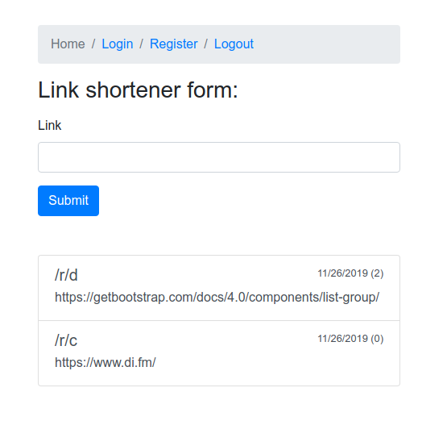

# Shortener PHP assessment
You are supposed to create a simple URL shortener (think: bit.ly )

#### Splitting given task into stories and putting estimations before coding
| Task description  | Given estimate | Real estimate |
| ------------- | ------------- | ------------- |
| Investigation existing shortener solutions (shorting functions)  | Content Cell  | Content Cell  |
| Create DB schema  | 30m  | 1h  |
| Describe class relation  | 25m  | 25m  |
| Create Dockerfile (Symfony 4) and tools | 15m  | 15m  |
| Create Contollers  | 1h  | 2h  |
| Create Entities  | 30m  | 1h  |
| Create Form  | 30m  | 1h  |
| Create Shortener Service  | 1h  | 1h  |
| Integrate and test app  | 3h  | 3h  |
| **Total**  | **7h**  | **9h**  |

### Resources I found and I would follow:
- https://en.wikipedia.org/wiki/Bijection
- https://www.geeksforgeeks.org/how-to-design-a-tiny-url-or-url-shortener/
- https://stackoverflow.com/questions/742013/how-do-i-create-a-url-shortener



### Requirements of the assessment:
- Make MVP
- Design proper shortening function

### Technologies used in the assessment
- Symfony 4.3
- Docker
- Docker Compose
- PHP 7.3.10
- PhpUnit 7.5.17
- Bash
- Git
- Bootstrap

### Prerequisites
Docker.io and docker-compose must be installed in the system in order to be able to use the app.
OS Linux

## How to setup the application:
```bash
git clone https://github.com/belushkin/shortener.git
cd shortener; ./toolbox.sh up
docker-compose exec web php bin/console doctrine:database:create
docker-compose exec web php bin/console doctrine:schema:create
```

## How to run tests
```bash
./toolbox.sh tests
```

### URL of the running app
http://localhost:8000/

http://localhost:8080 (adminer)

- server: db-mysql
- username: root
- password: root
- db: app

## Basic script usage:
Application has **toolbox.sh** script. It is very easy run, stop, ssh, rebuild, run tests and stop the application.

```bash
./toolbox.sh up # run the application
./toolbox.sh rebuild # rebuild the image
./toolbox.sh ssh # ssh to the container
./toolbox.sh tests # run tests
./toolbox.sh down # stop the application
```

## Contributors
@belushkin

## License
MIT License
